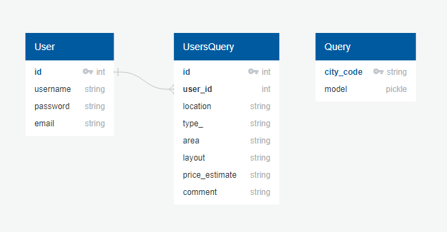

## Yosoku

A single-page web application that uses machine learning models to predict real estate prices in Japan

## Live Version

https://yosoku-app-ry.herokuapp.com/

## Technologies Used

Python/Flask, PostgreSQL, SQLAlchemy, Heroku, Jinja, RESTful APIs, JavaScript, Redis, flask-celery, HTML and Bootstrap4

## API Link:

https://www.land.mlit.go.jp/webland/

## Database Schema

